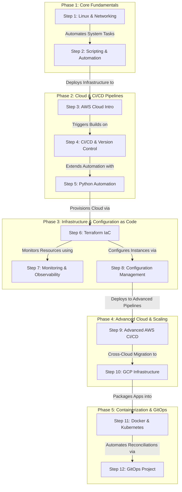

# Comprehensive DevOps Learning Roadmap 🚀

Welcome to my DevOps repository! This space contains structured notes, scripts, and hands-on project documentation documenting my journey into DevOps, Cloud Architecture, and Automation. 

It is designed to be easily readable for anyone looking to learn these technologies step-by-step.

**Tavva Sandeep Kumar Reddy**

---

## Repository Structure

```text
devops-roadmap-notes/
├── README.md                     # Overview of the learning path
├── 01-Linux-and-Networking/      # Linux basics, Vagrant, Networking, VProfile
├── 02-Bash-and-Scripting/        # YAML, JSON, Bash, GitHub Copilot
├── 03-AWS-Cloud-Intro/           # EC2, IAM, S3, Lift & Shift AWS Projects
├── 04-CICD-and-Version-Control/  # Git, Maven, Jenkins, GitHub Actions
├── 05-Python-Automation/         # Python Scripting & Amazon Q
├── 06-Terraform-IaC/             # Terraform Modules, State, VPC Setup
├── 07-Monitoring-Observability/  # Prometheus, Grafana, Loki, PromQL
├── 08-Ansible-Config-Management/ # Playbooks, Roles, AWS Automation
├── 09-AWS-Advanced-CICD/         # VPC Deep Dive, Lambda, Beanstalk
├── 10-GCP-Infrastructure/        # GCP VMs, Cloud SQL, Load Balancers
├── 11-Docker-and-Kubernetes/     # Containers, Helm, K8s VProfile Deployment
└── 12-GitOps-Project/            # Final GitOps Implementation
```

---

## Interactive Learning Workflow

The following flowchart illustrates the step-by-step progression and interaction between different modules in this roadmap, moving from basic system administration to advanced cloud-native GitOps deployment.



---

## Table of Contents & Roadmap

### [Step 1: Linux & Networking Basics](./01-Linux-and-Networking)
* Basics of Linux & Server Management
* Vagrant & Basics of Networking
* **Project:** VProfile Intro & Setup on VMs

### [Step 2: Scripting & Automation](./02-Bash-and-Scripting)
* YAML & JSON Data Structures
* Bash Scripting (Variables, Conditions, Loops)
* Automating Admin Tasks & Using GitHub Copilot

### [Step 3: AWS Cloud Introduction](./03-AWS-Cloud-Intro)
* Cloud Computing Intro (IAM, EC2, EBS, ELB)
* SSM, CloudShell, AWS CLI, S3, RDS, Auto Scaling
* **Project:** Lift & Shift Web App to AWS
* **Project:** Re-Architecting Web App on AWS (PaaS & SaaS)

### [Step 4: CI/CD & Version Control](./04-CICD-and-Version-Control)
* Git & GitHub, Maven Build Tools
* Jenkins (CI/CD Pipelines, Master/Slave, SonarQube)
* GitHub Actions & GitLab CI/CD Integration

### [Step 5: Python Automation](./05-Python-Automation)
* Python Scripting for OS Task Automation
* Python for AWS using Amazon Q

### [Step 6: Infrastructure as Code (IaC)](./06-Terraform-IaC)
* Terraform Fundamentals (Variables, Modules, Backends)
* **Project:** Infrastructure as Code for VPC Setup

### [Step 7: Monitoring & Observability](./07-Monitoring-Observability)
* Prometheus, Grafana, Loki, and Alloy
* PromQL Queries & Dashboard Building
* Slack Integrations for Real-Time Alerts

### [Step 8: Configuration Management](./08-Ansible-Config-Management)
* Ansible Intro (Ad Hoc Commands, YAML Basics)
* Playbooks, Roles, Handlers, and Templates
* Ansible for AWS Automation

### [Step 9: Advanced AWS CI/CD](./09-AWS-Advanced-CICD)
* VPC Deep Dive, Lambda, Logging, Custom Metrics
* **Project:** CI/CD on AWS (Beanstalk, RDS, CodePipeline)

### [Step 10: GCP Infrastructure](./10-GCP-Infrastructure)
* Cloud Shell, VPC, Firewalls, VMs, Cloud SQL
* Managed Instance Groups & Load Balancers
* **Project:** Multi-Tier App Setup on Google Cloud Platform

### [Step 11: Containerization & Orchestration](./11-Docker-and-Kubernetes)
* Docker (Images, Volumes, Networks)
* Kubernetes Setup, Autoscaling, Ingress, ConfigMaps
* Helm with AI, Lens
* **Project:** VProfile Deployment on Kubernetes

### [Step 12: GitOps](./12-GitOps-Project)
* **Project:** Comprehensive GitOps Implementation

---
*Feel free to star ⭐ this repository if you find these notes helpful!*